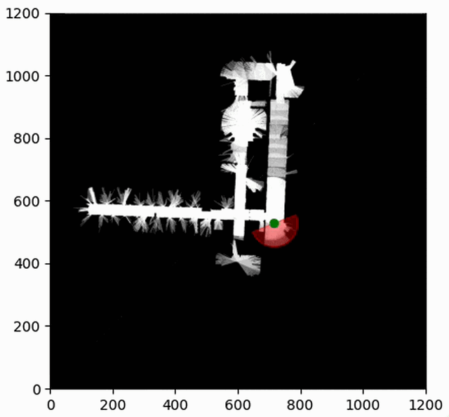

# Occupancy Grid Mapping

This repository contains a python application for processing odometry and laser data, and plotting the results using an Occupancy Grid map.



The application reads the input datasets from the `config.yaml` file, processes the data, and plots an occupancy grid map.

## Repository Structure

```bash
.
├── LICENSE                      # Contains the license agreement 
├── README.md                    # The top-level description and general information
├── config                       # Configuration files directory
│   └── config.yaml              # Main configuration file
├── data                         # Data files directory
│   ├── input                    # Input data files
│   │   ├── orebro.gfs.log       # Data input file
│   └── output                   # Output data/files generated
│       ├── occupancy_plot.pdf   # Generated occupancy plot
│       └── output.gif           # Generated Gif
├── docs                         # Documentation files
├── setup.py                     # Build script for setuptools. Helps in packaging and distribution.
└── src                          # Source code directory
    ├── __init__.py              # Makes the directory a package
    ├── config_parser.py         # Source file to parse the configuration file
    ├── data_processing.py       # Handles data processing operations
    ├── main.py                  # Main application source file
    ├── map_operations.py        # Handles map related operations
    ├── occupancy.py             # Source file for occupancy grid functionalities
    └── plot_operations.py       # Handles plot operations

```

## Setup and Running
1. First, clone the repository and navigate into it:
```bash
git clone https://github.com/Swepz/LidarBasedGridMapping
cd LidarBasedGridMapping
```
2. Then, create a virtual environment (optional but recommended):
```bash
python3 -m venv venv
source venv/bin/activate  # On Windows use `venv\Scripts\activate`
```
3. Install the necessary dependencies:
```bash
pip install .
```
4. To run the main script:
```bash
cd src
python3 main.py
```

This will process the datasets specified in the config.yaml file and generate the occupancy grid map plot occupancy_plot.pdf.

## Configuring the Script
You can modify the config.yaml file to change the behavior of the script. 

## Dataset source

The dataset used in this project originates from the [Robotics 2D-Laser Datasets](http://www2.informatik.uni-freiburg.de/~stachnis/datasets.html) provided by the University of Freiburg. This project specifically uses the 'Orebro' dataset.

The raw log data for the 'Orebro' dataset was kindly provided by Henrik Andreasson, Per Larsson, and Tom Duckett. The dataset format is the 'corrected-log' in the Carmen framework. This rich dataset allows us to demonstrate the functionality and potential applications of our Occupancy Grid Mapping project effectively.


## License
This project is licensed under the terms of the MIT license. See the [LICENSE](LICENCE) file for the full text of the license.